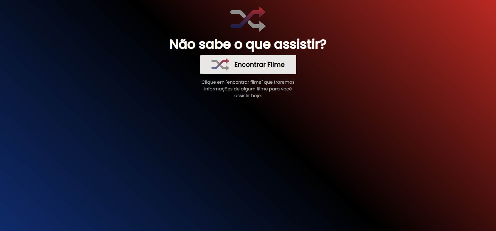
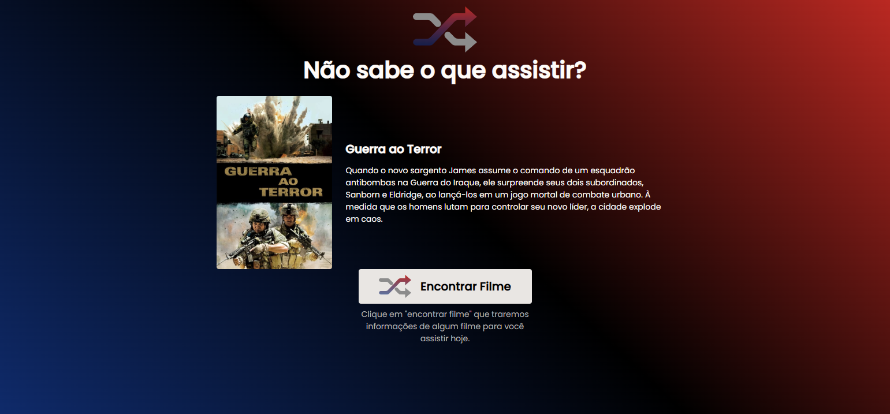

# Página de Login

## Descrição do Projeto

Uma página de sugestões de filmes, realizada a partir das diretrizes do <a href="https://efficient-sloth-d85.notion.site/Desafio-Rocketflix-5ca1c56b5e52473eb12e8b2bc3ab1b8d#06e6ecb4212447c695dfbe7da61ec551">desafio da Rocketseat!</a> Este projeto utiliza API pública do <a href="https://www.themoviedb.org/">themoviedb.org</a> para exibir um filme aleatório.
 

<h1 align="center">
  
</h1>

<h1 align="center">
  
</h1>

### 🛠 Tecnologias

As seguintes ferramentas foram usadas na construção do projeto:

- [HTML](https://developer.mozilla.org/pt-BR/docs/Web/HTML)
- [CSS](https://developer.mozilla.org/pt-BR/docs/Web/CSS)
- [Javascript](https://developer.mozilla.org/pt-BR/docs/Web/JavaScript)

### Autor
---

Feito com por Nathalia Azevedo 👋🏽 Entre em contato!

